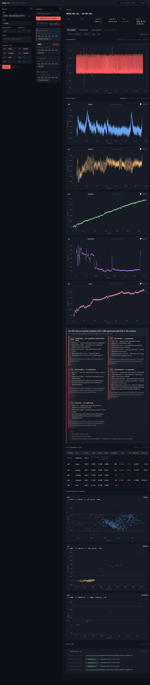
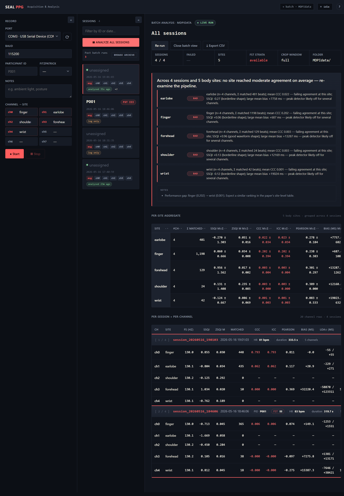

# Dashboard guide — by goal

Goal-oriented walkthroughs. If you want a feature-by-feature manual instead, read [`../webapp/README.md`](../webapp/README.md).

---

## "I just plugged in a Pi Pico and want to record"

1. `python app.py` — opens `http://127.0.0.1:8000/`. First time you'll get a 6-step onboarding modal; click through or dismiss.
2. In the **Record** sidebar (left), pick the Pico's COM port. Click `⟳` if it's not listed.
3. Fill the participant form: PID (e.g. `P004`), Fitzpatrick I–VI, free-form notes, and confirm the **Channel → Site** map (defaults: ch0=finger, ch1=earlobe, ch2=shoulder, ch3=forehead, ch4=wrist; the map persists in your browser).
4. Click **● Start**. The status pill turns red `RECORDING`, a new `MDPIdata/session_<ts>/` folder is created, and live ECG + per-channel PPG traces start refreshing every second.
5. Watch the counter strip under the form — every channel should be ticking. If one stays at 0, that mux lane didn't enumerate; reseat the MAX30102 and restart.
6. When you're done, click **■ Stop**. The dashboard captures the full receiver log to `receiver.log`, auto-runs the SQI / CCC / ICC pipeline, and shows the plain-English interpretation block + SQI table + Bland-Altman cards.

**Where the result lives:** `MDPIdata/session_<UTC_timestamp>/`. Everything — CSVs, metadata, analysis, history log, receiver log — is in that one folder.

---

## "I want to look at last week's recording"

1. In the **Sessions** sidebar (middle), filter by date or PID.
2. Click the session card. Persistence badges show at a glance whether it has been analysed (`analysed Xs ago`, `×N`), or only logged (`log only`).
3. The detail column fills automatically: ECG hero, PPG channels, SQI/CCC/ICC table, Bland-Altman per channel, plain-English interpretation block.
4. To re-run the pipeline (e.g. after editing site labels), click **Run analysis**. The result overwrites `analysis.json` and appends an `analysis_run` event to `history.jsonl`.
5. To crop the analysis to a specific window, type `start` / `end` (seconds since session t0) in the Window controls and click **Apply**. **Full** restores the whole recording.

---

## "I want one summary number per body site across every session in MDPIdata"

1. Click **▦ Analyze all sessions** at the top of the Sessions sidebar.
2. The detail column switches to the batch view. The first block is the plain-English **Batch interpretation** ("Across N sessions and M body sites: best site is finger (mean CCC 0.20, only poor agreement)").
3. **Per-site aggregate** table below — mean ± std for SSQI, ZSQI, KSQI, CCC, ICC, Pearson, bias, LOA span, RMSE, MAE. Click any column header to sort ▴/▾.
4. **Per-session × per-channel** at the bottom — every channel of every session, grouped under sticky session-header rows. Click a session ID to drill into the per-session view.

**Where the result lives:** `MDPIdata/batch_analyses/batch_<ts>.json`. A `batch_analysis_included` event is also appended to every included session's `history.jsonl`.

---

## "I want to know whether a channel's CCC of 0.62 means anything"

Read the **plain-English interpretation block** above the SQI table — for that channel, it'll show something like:

> **WARN** ch0 (finger) — poor agreement, inspect before using
> - SSQI +0.85 — positive skew, pulse shape is recognisable.
> - ZSQI 0.030 (σ 0.008) — low, stable zero-crossing rate, sensor contact looks consistent.
> - KSQI 2.14 — in the clean-PPG band around 2 (Elgendi 2016: 2.06±0.16 for excellent finger PPG).
> - CCC 0.620, ICC 0.620 — poor agreement (Lin 1989: <0.90).
> - Bland-Altman bias +12.3 ms — within typical PTT range; ±LOA span 220 ms, RMSE 38.5 ms.
> - *Look at the PPG trace for ectopic beats, missed peaks, or motion bursts.*

For the full threshold tables (good/ok/warn/bad cut-offs for each metric), read [`INTERPRETATION_GUIDE.md`](INTERPRETATION_GUIDE.md).

---

## "I want the batch tables in Word / Excel"

In the batch view header, click **⤓ Export CSV**. Downloads `<batch_id>.csv` containing **every table in the view** — per-site, HR, SDNN, LF/HF, the same four repeated for each skin-tone band, and per-session × per-channel — as separate blocks, each with a title row and separated by a blank line.

To get one into Word as a real table: open the CSV in Excel, select the block you want, copy, then paste into Word. Cells arrive pre-formatted exactly as the dashboard shows them (`2.728 ± 1.206`), so nothing needs reassembling. Pasting straight from the browser instead tends to collapse a table's rows into a single run of text — go via the CSV.

---

## "I want to re-open the batch I ran yesterday"

1. In the Sessions sidebar, the **Past batch runs** row shows the count (e.g. `Past batch runs 12`).
2. Click **Browse archive**.
3. The modal lists every saved batch run: timestamp, n sessions analyzed, crop window.
4. Select one — the batch view reloads from disk (no re-running). The header chip changes from `● LIVE RUN` to `ARCHIVE · BATCH_<ts>`.

---

## "I want to see the raw receiver log from a problematic session"

1. Select the session in the Sessions sidebar.
2. In the detail header, click **View receiver log**. (Disabled with a tooltip if the session has no `receiver.log` — either older recording, or the capture failed.)
3. The modal shows the last 500 lines, monospace, scrollable. **Refresh** refetches in case you're tailing during a separate process.

---

## "I want to re-trigger the onboarding modal"

Click the **?** button in the top-right of the header. Toggling **Don't show again** sets `localStorage["seal_ppg_onboarded"]`; clearing localStorage from devtools re-arms the auto-trigger.

---

## "I want to edit a session's metadata"

1. Select the session.
2. Fill the participant form on the left (PID, FST, notes, channel→site overrides).
3. Click **Save metadata**.
4. The form value persists to `participant.json`, a `metadata_edited` event with `before` and `after` blocks is appended to `history.jsonl` (full audit trail — nothing is lost when you correct a typo), and the SQI table relabels itself with the new site names.

---

## "I want to delete a session"

1. Select the session.
2. Click **Delete session** in the detail header.
3. A confirmation modal opens. To enable Delete, pick "Permanently delete this session" from the dropdown — the deliberate gesture prevents misclicks.
4. Click **Delete**.

The session folder and every CSV inside it is removed. The selection moves to the next session (or to the empty state if it was the last one).

> Sessions that are currently recording cannot be deleted — the dashboard returns 409.
